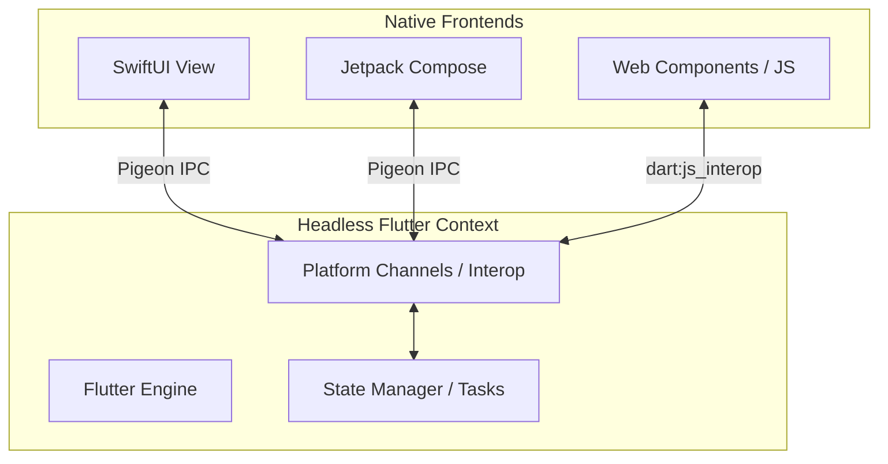

# Creating a Flutter App with 100% Native UIs

This skill provides step-by-step guidance on implementing a decoupled architectural design where a **headless Flutter engine** acts as the shared single source of truth (SSOT) running in the background, while the user interfaces are built using platform-native toolkits.



---

## 1. Interop Layer Setup

### Mobile (Pigeon Code-Gen)
Pigeon is used for type-safe IPC communication between Dart and Swift/Kotlin.
Create a pigeon definition file at `pigeons/tasks_api.dart`:
- Use `@HostApi` for calls originating from native code that Dart answers.
- Use `@FlutterApi` for calls originating from Dart that native platforms listen to.

Compile the interfaces using the Pigeon CLI:
```bash
dart run pigeon --input pigeons/tasks_api.dart
```

### Web (JS Interop)
Use `dart:js_interop` to bind functions to the global `window` object:
- Define `@JS('window.methodName')` setters to bind Dart triggers.
- Define `@JS('window.callbackName')` getters to notify host JS components of updates.

---

## 2. Bootstrapping Headless Engines

### iOS (AppDelegate.swift)
Instantiate `FlutterEngine` without a visual viewport controller:
1. Declare `var flutterEngine: FlutterEngine?`.
2. Instantiate `let engine = FlutterEngine(name: "my-engine")` and call `engine.run()`.
3. Set up the custom event handler store (`TaskStore`) to listen on the binary messenger:
   `store.setup(binaryMessenger: engine.binaryMessenger)`.
4. Wrap your SwiftUI view using `UIHostingController` and present it in the main `UIWindow`.

### Android (MainActivity.kt)
Instantiate a headless `FlutterEngine` inside a standard Compose activity:
1. Override `onCreate` in a subclass of `ComponentActivity`.
2. Instantiate `FlutterEngine(this)` and invoke `executeDartEntrypoint(...)`.
3. Connect your Pigeon host/client endpoints using the engine's `dartExecutor.binaryMessenger`.
4. Set up Compose UI using `setContent { ... }`.
5. Call `flutterEngine.destroy()` on `onDestroy()`.

### Web (flutter_bootstrap.js)
Boot Flutter Web headlessly by specifying a hidden target container:
1. Create a `flutter_bootstrap.js` mapping:
   ```javascript
   engineInitializer.initializeEngine({
     hostElement: document.getElementById('flutter-host') // Styled with display: none
   })
   ```

---

## 3. UI Synchronization & State Management

Native clients should observe updates from the headless engine reactively:
* **iOS**: Implement `ObservableObject` and dispatch events to SwiftUI views via `@Published` properties on `DispatchQueue.main.async`.
* **Android**: Use a Kotlin `StateFlow` updated via the Pigeon host API callback. Connect Compose views using `.collectAsState()`.
* **Web**: Create custom HTML5 Web Components dispatching custom bubbles events (`toggle-task`, `delete-task`) up the DOM hierarchy.

---

## 4. Resource & Verification Scripts

The resource folder contains CLI compilation check scripts:
- `resources/check_ios.sh`: Validates Swift compilation and framework linkage.
- `resources/check_android.sh`: Triggers Kotlin compile tasks to catch build errors before simulator deployment.
